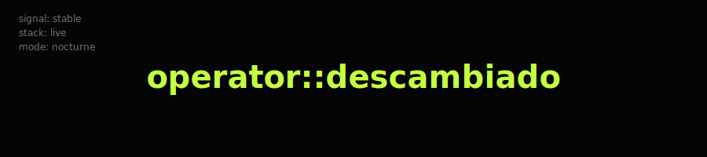

<!-- Purple Theme: #9d4edd, #7b2cbf, #5a189a, #c77dff -->

<div align="center">


**<span style="color: #9d4edd;">Systems</span> · <span style="color: #7b2cbf;">Cybersecurity</span> · <span style="color: #c77dff;">Automation</span>**  
**Operativo real. Laboratorios reales. Sin teatro.**



</div>

---

## SYSTEM STATUS

```
profile_version : 2026.3
operator_state  : active
workspace       : live
visibility      : public surface / private core
org             : SotyDev
```

---

## LIVE TELEMETRY

<div align="center">


</div>

---

## 🚀 INTERACTIVE TERMINAL & WEB

<div align="center">

**[🌐 View Advanced Web Profile](https://descambiado.github.io/descambiado/)** | **[💻 Interactive Terminal](profile-terminal.html)**

<details>
<summary>Click to view terminal preview</summary>


</details>

</div>

---

## 👤 PROFILE / IDENTITY

<div align="center">

**<span style="color: #9d4edd; font-size: 1.2em;">David Hernández</span>**  
**<span style="color: #7b2cbf;">@descambiado</span>**

```
Name      : David Hernández
Handle    : @descambiado
Location  : Spain
Domain    : Infrastructure, Cybersecurity Operations, Automation Engineering
Org       : SotyDev
GitHub    : https://github.com/descambiado
```

</div>

---

Esto **no** es un portfolio.  
Esto es un **taller operativo**.

Aquí vas a ver:
- tooling experimental
- prototipos operativos
- sistemas a medio cocinar
- laboratorios de ataque/defensa
- frameworks internos expuestos en público

Todo existe para **romperse**, **medirse** y **mejorarse**.

---

## OPERATIONAL FOCUS

[+] Blue / Red / Purple Team convergence  
[+] Observabilidad y monitoreo de infraestructura  
[+] Honeypots, telemetría del atacante y trazabilidad  
[+] Tooling para SOC y respuesta real  
[+] Automatización de tareas operativas repetitivas  
[+] Externalización del conocimiento con herramientas abiertas

Principios de diseño:
- sistemas observables
- labs reproducibles
- mínima abstracción
- máxima visibilidad
- realismo operativo

---

## CORE CAPABILITIES

**INFRASTRUCTURE**
- Linux (Kali, Debian-based environments)
- Orquestación de servicios con Docker
- Provisionamiento con Terraform
- Azure environments
- Pipelines de monitoreo (Zabbix)

**CYBERSECURITY**
- Web application testing
- Attack surface mapping
- Honeypot deployment and telemetry
- Adversary behavior observation
- Defensive visibility design

**AUTOMATION**
- Bash
- PowerShell
- Python
- Git-based workflows
- Internal automation frameworks

---

## PROJECT ECOSYSTEM

**SOTYHUB**  
Community-driven cybersecurity lab and knowledge ecosystem  
https://sotyhub.com

**SOTYBOT**  
Operator-oriented AI assistant / open agent engine  
https://github.com/descambiado/Sotybot

**BOFA**  
Best Of All Cybersecurity Suite  
https://github.com/descambiado/BOFA

**SOTYPOT**  
Modular multi-honeypot platform (TPOT CE remix)  
https://github.com/descambiado/Sotypot

**SOTY SENTINEL DEFENSE GRID**  
Private R&D: detection surfaces and defensive grids

**BABY PLUTO GUARD**  
Lightweight operator companion tooling

**KUOOREX / YUNG KUOO**  
Creative R&D: digital identity and tech narrative via music tooling

**FOQUITAS ECOSYSTEM**  
Web/theme experiments for frontend and deployment practice

---

## MANIFEST

No construyo para métricas.  
No publico para validación.  
Publico para **externalizar conocimiento operativo**.

Aquí hay:  
iteraciones, fallos, sistemas parciales, experimentos vivos.

Si te sirve, úsalo.  
Si lo puedes mejorar, contribuye.

---

## EXTERNAL CHANNELS

WEB        : https://descambiado.com  
SOTYHUB    : https://sotyhub.com  
BLOG       : https://noticias.sotyhub.com  
DISCORD    : https://discord.gg/sotyhub  
YOUTUBE    : https://youtube.com/@Descambiado  
INSTAGRAM  : https://instagram.com/descambiado  
TIKTOK     : https://tiktok.com/@descambiado  
LINKEDIN   : https://linkedin.com/in/david-hernández-jiménez

---

<div align="center">


</div>

<pre style="color: #9d4edd; text-align: center;">
descambiado != broken
descambiado == out of pattern
profile_version = 2026.3
automation_status = ACTIVE
</pre>

---

<div align="center">

**<span style="color: #9d4edd;">⚡ Fully Automated Profile ⚡</span>**  
*Updated automatically via GitHub Actions*

</div>
