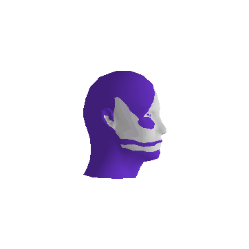
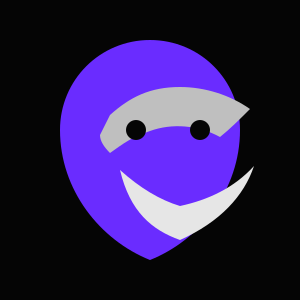

<!-- Purple Theme: #9d4edd, #7b2cbf, #5a189a, #c77dff -->
<!-- #9d4edd · #7b2cbf · #5a189a · #c77dff -->

<a href="#status">status</a> · <a href="#focus">focus</a> · <a href="#projects">projects</a> · <a href="#manifest">manifest</a> · <a href="#channels">channels</a>

<pre style="color: #6C0078; font-size: 10px; line-height: 1.2; margin: 6px 0; letter-spacing: 2px;">
 .S_sSSs      sSSs    sSSs    sSSs   .S_SSSs     .S_SsS_S.    .S_SSSs     .S   .S_SSSs     .S_sSSs      sSSs_sSSs    
.SS~YS%%b    d%%SP   d%%SP   d%%SP  .SS~SSSSS   .SS~S*S~SS.  .SS~SSSSS   .SS  .SS~SSSSS   .SS~YS%%b    d%%SP~YS%%b   
S%S   `S%b  d%S'    d%S'    d%S'    S%S   SSSS  S%S `Y' S%S  S%S   SSSS  S%S  S%S   SSSS  S%S   `S%b  d%S'     `S%b  
S%S    S%S  S%S     S%|     S%S     S%S    S%S  S%S     S%S  S%S    S%S  S%S  S%S    S%S  S%S    S%S  S%S       S%S  
S%S    S&S  S&S     S&S     S&S     S%S SSSS%S  S%S     S%S  S%S SSSS%P  S&S  S%S SSSS%S  S%S    S&S  S&S       S&S  
S&S    S&S  S&S_Ss  Y&Ss    S&S     S&S  SSS%S  S&S     S&S  S&S  SSSY   S&S  S&S  SSS%S  S&S    S&S  S&S       S&S  
S&S    S&S  S&S~SP  `S&&S   S&S     S&S    S&S  S&S     S&S  S&S    S&S  S&S  S&S    S&S  S&S    S&S  S&S       S&S  
S&S    S&S  S&S       `S*S  S&S     S&S    S&S  S&S     S&S  S&S    S&S  S&S  S&S    S&S  S&S    S&S  S&S       S&S  
S*S    d*S  S*b        l*S  S*b     S*S    S&S  S*S     S*S  S*S    S&S  S*S  S*S    S&S  S*S    d*S  S*b       d*S  
S*S   .S*S  S*S.      .S*P  S*S.    S*S    S*S  S*S     S*S  S*S    S*S  S*S  S*S    S*S  S*S   .S*S  S*S.     .S*S  
S*S_sdSSS    SSSbs  sSS*S    SSSbs  S*S    S*S  S*S     S*S  S*S SSSSP   S*S  S*S    S*S  S*S_sdSSS    SSSbs_sdSSS   
SSS~YSSY      YSSP  YSS'      YSSP  SSS    S*S  SSS     S*S  S*S  SSY    S*S  SSS    S*S  SSS~YSSY      YSSP~YSSY    
                                           SP           SP   SP          SP          SP                              
                                           Y            Y    Y           Y           Y                               
                                                                                                                     
</pre>

SOC ANALYST · PURPLE TEAM · TOOL BUILDER

David Hernández · operator · out of pattern

<a href="https://descambiado.github.io/descambiado/" style="color: #c77dff; text-decoration: none; font-size: 11px; letter-spacing: 0.15em;">[ web ]</a> · <a href="https://github.com/descambiado/descambiado" style="color: #c77dff; text-decoration: none; font-size: 11px; letter-spacing: 0.15em;">[ repo ]</a>

---

<pre style="color: #7b2cbf; font-size: 9px; margin: 0 0 6px 0;">
                                
mmm,             '          'T  
 ]   m,  ,m .mm .m  ..,  m,  ]  
 ]  ]`]  P `]]]  ]  ]`] ' ]  ]  
 ]  ]""  [  ]]]  ]  ] ] ."T  ]  
 ]  'b/  [  ]]] .dm ] ] 'mT  'm 
</pre>

<pre style="background: #0d1117; border: 1px solid #7b2cbf; border-radius: 4px; padding: 12px 16px; color: #c77dff; font-size: 12px; margin: 0;">
operator_state  : active
focus           : detection engineering · purple team · automation
workspace       : live
</pre>

<pre style="color: #5a189a; font-size: 9px; margin: 8px 0 0 0;">now · detection rules · purple exercises · BOFA iterations</pre>

---

<pre style="color: #7b2cbf; font-size: 9px; margin: 0 0 6px 0;">
                        
 mm  .       .          
]` `.dm  m, .dm . .  m, 
'bm  ]  ' ]  ]  ] ] ] ' 
  '[ ]  ."T  ]  ] ]  "\ 
'md` 'm 'mT  'm 'mT 'm/ 
</pre>

**Detection Engineering** — MITRE ATT&CK · SIEM correlation · Threat hunting  

**Purple Team Operations** — Red/Blue convergence · Adversary simulation · Defensive validation  

**Automation & Tooling** — Python · Bash · APIs · Internal frameworks  

**BOFA Suite** — 150+ tools for Blue/Red/Purple Team operations  

Python · Bash · Docker · Terraform · MITRE ATT&CK · Zabbix

---

<pre style="color: #7b2cbf; font-size: 9px; margin: 0 0 6px 0;">
                                                
,  ,            .mm       ]  '    ]      '   .  
',/  m,  m,      ]       md .m   md     .m  .dm 
 T` ]`] ] '      ]      ]`T  ]  ]`T      ]   ]  
 ]  ]""  "\      ]      ] ]  ]  ] ]      ]   ]  
 ]  'b/ 'm/     .dm     'bW .dm 'bW     .dm  'm 
                                                
                                                
</pre>

**SotyHUB** — Founder, Main Ecosystem Developer, Cybersecurity community & knowledge ecosystem · <code style="color: #7b2cbf;">sotyhub.com</code>  

**BOFA** — Cybersecurity Operations Framework Advanced (150+ tools) · <code style="color: #7b2cbf;">github.com/descambiado/BOFA</code>  

**SOTYBOT** — Operator-oriented AI assistant / open agent engine · <code style="color: #7b2cbf;">github.com/descambiado/Sotybot</code>  

**SOTYPOT** — Modular multi-honeypot platform (TPOT CE remix) · <code style="color: #7b2cbf;">github.com/descambiado/Sotypot</code>  

**Baby Pluto Guard** — Educational monitoring & detection scanner  

---

---

<pre style="color: #7b2cbf; font-size: 9px; margin: 0 0 6px 0;">
            
 .m  .m  .m 
 ` [ ` [ ` [
 .P  .P  .P 
 '   '   '  
 ]   ]   ]  

</pre>

No construyo para métricas. No publico para validación.  
Publico para **externalizar conocimiento operativo**.  
Aquí hay: iteraciones, fallos, sistemas parciales, experimentos vivos.  
Si te sirve, úsalo. Si lo puedes mejorar, contribuye.

Operador. Construyo en público. <code>descambiado</code> = fuera del patrón esperado.

---

<pre style="color: #7b2cbf; font-size: 9px; margin: 0 0 6px 0;">
                                
 .m ]                   'T      
.` `].,  m, .., ..,  m,  ]   m, 
]   ]`] ' ] ]`] ]`] ]`]  ]  ] ' 
]   ] ] ."T ] ] ] ] ]""  ]   "\ 
 \m`] ] 'mT ] ] ] ] 'b/  'm 'm/ 
</pre>

<a href="https://descambiado.com" style="color: #c77dff;">WEB</a> · <a href="https://sotyhub.com" style="color: #c77dff;">SOTYHUB</a> · <a href="https://noticias.sotyhub.com" style="color: #c77dff;">BLOG</a> · <a href="https://discord.gg/sotyhub" style="color: #c77dff;">DISCORD</a> · <a href="https://youtube.com/@Descambiado" style="color: #c77dff;">YOUTUBE</a> · <a href="https://github.com/descambiado" style="color: #c77dff;">GITHUB</a>

---

<pre style="color: #7b2cbf; font-size: 9px; margin: 0 0 8px 0;">═══════════════════════════════════</pre>

<pre style="color: #9d4edd; font-size: 11px; margin: 8px 0;">
descambiado != broken  ·  descambiado == out of pattern
</pre>

<pre style="color: #5a189a; font-size: 9px;">David Hernández · @descambiado · operator · live · 2026</pre>

